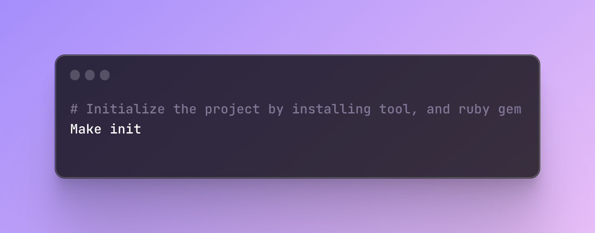
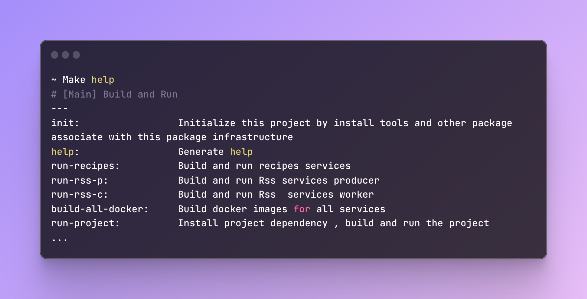

# GOLANG Backend Clean Architecture

A Distributed Golang backend system, meticulously designed with scalability, extendability , testability, and recovery in mind through a clean architecture. This project comprises three autonomous microservices that uphold a contract-based communication paradigm, each ingeniously crafted with distinct design strategies—ranging from test-driven and behavior-driven to event-driven methodologies. Notably, this architecture seamlessly accommodates extensible localization through a locale query, enriched with articulate schema violation explanations for enhanced user navigation.

The technology i included in this project:

- **Fibe**: A robust HTTP framework.
- **Nginx**: A versatile Reverse Proxy Server, doubling as a TLS termination proxy.
- **MongoDB**: The project's cornerstone database, thoughtfully partitioned into collections for individual services.
- **Auth0**: A managed service for seamless user management.
- **RabbitMQ**: An ingenious message broker optimizing task orchestration.
- **Oauth**: Utilizing both identity and access tokens for authentication, powered by JWT.
- **HashiCorp Vault**: Empowering the project with centralized management of static secrets (extending .env files) and dynamic secrets (for MongoDB database authentication).
- **AWS KMS**: Safeguarding encryption keys, notably the seal key for HashiCorp Vault.
- **AWS SQS**: Serving as a RabbitMQ substitute when deployed within the AWS ecosystem.
- **Docker**: Ensuring effortless deployment and management.
- **Redis**: A robust caching solution curbing inefficiencies and bolstering security by tracking failed attempts.
- **i18n**: Embracing localization diversity.
  The architecture is seamlessly orchestrated, pruned, and debugged through Ruby Script.

## Basic Service Architecture

- **Router**: Navigates and manages public and private routes.
- **Middleware**: Facilitates localization, validation, and authentication.
- **Controller**: Orchestrates route-associated actions and validates data.
- **UseCase**: Houses intricate business logic, executed when invoked by the Controller.
- **Repository**: Empowered by the UseCase, responsible for data operations.
- **Domain**: The foundation, it holds the models for requests and responses, the database entities, and the interfaces that tie it all together.

### Benefit

This architecture provide thhe following benefit :

- Platform-agnostic flexbility
- A baston of testability
- Streamlined feature development
- Effortless adaptability to code modifications
- Seamless collaboration across services

# Project usages:

